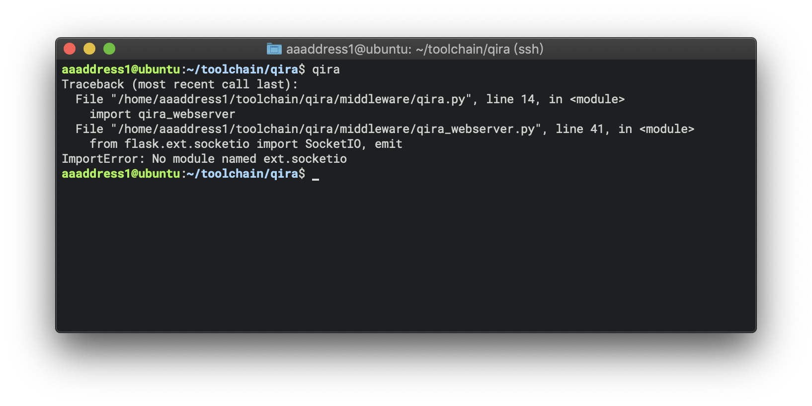
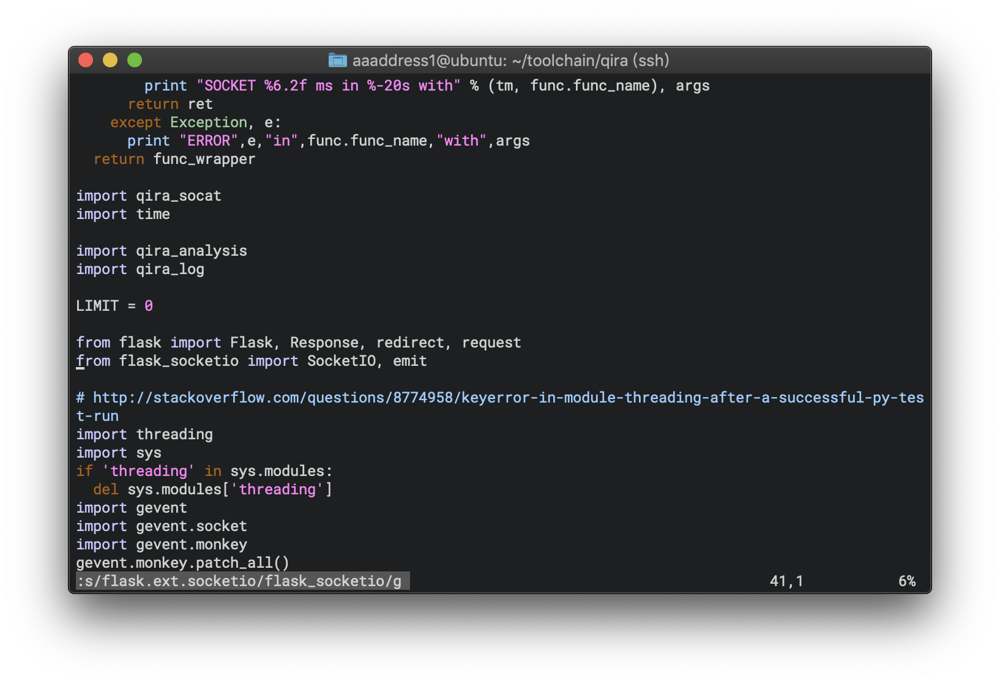
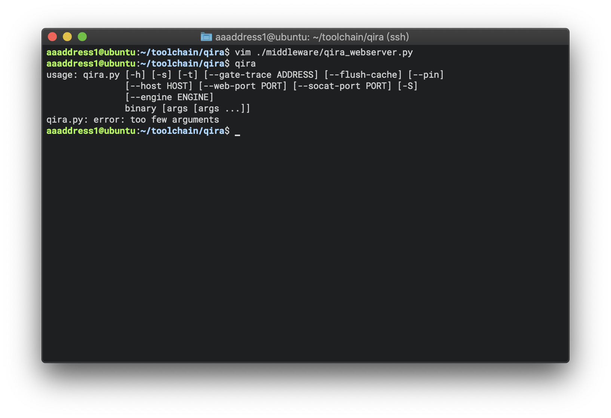

# [qira] ImportError: No module named ext.socketio

Refer to  [flask.ext.socketio is deprecated, use flask_socketio instead. by DuckLL · Pull Request #200 · geohot/qira · GitHub](https://github.com/geohot/qira/pull/200), this problem appears due to **flask.ext.socketio** is deprecated at the latest version flask package.

Thus, what we need to do is editing the qira_webserver.py *(located at qira/middleware/qira_webserver.py)*, and replace the imported module from **flask.ext.socketio** to **flask_socketio**. We can simply type **s/flak.ext.socketio/flask_socketio/g** in vim to replace.

Save it, and type **qira** again. Everything works well.

This issue has been pushed on the geohot repository and accepted for a long while. I've tried to pull the lastest repository from Github and  install, but still broken. So I write this note for those people have the same problem.